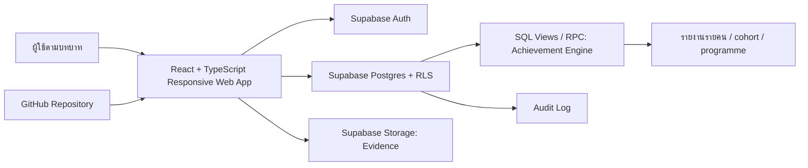
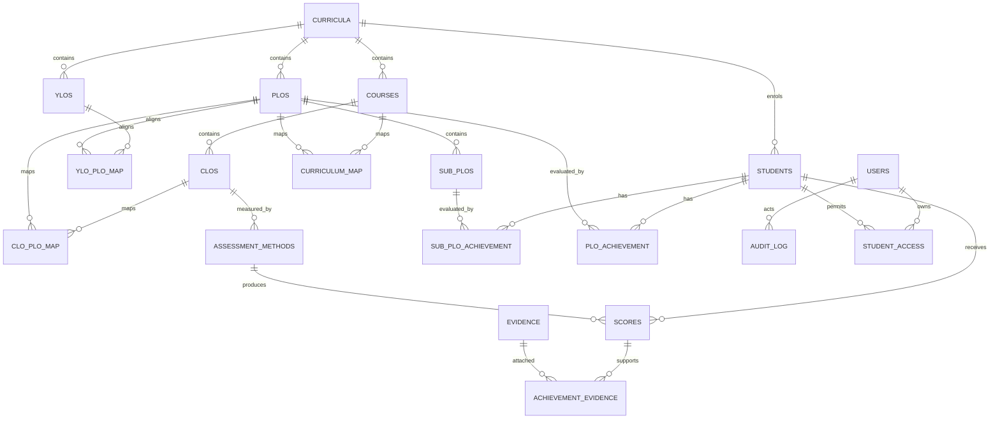

# เอกสารออกแบบระบบ PLOs Assessment System — ฉบับยืนยันก่อนพัฒนา

**โครงการ:** ระบบสารสนเทศเพื่อการประเมินผลลัพธ์การเรียนรู้ระดับหลักสูตร (PLOs Assessment System)  
**หน่วยงาน:** วิทยาลัยพยาบาลบรมราชชนนี กรุงเทพ คณะพยาบาลศาสตร์ สถาบันพระบรมราชชนก  
**วันที่จัดทำ:** 27 สิงหาคม 2569  
**แหล่งความต้องการ:** Master Prompt ฉบับปรับปรุงที่ผู้ใช้แนบมา

> **ข้อกำหนดแกนกลาง:** ระบบต้องตอบคำถามระดับรายบุคคลว่า “นักศึกษาคนนี้ผ่าน PLO ข้อนี้หรือไม่” อย่างตรวจสอบย้อนกลับได้ ก่อนจึงรวมผลขึ้นเป็นรายชั้นปี รายรุ่น และรายหลักสูตร

## 1. สรุปความเข้าใจและขอบเขตที่จะพัฒนา

ระบบนี้เป็นเว็บแอปภาษาไทยแบบ responsive สำหรับจัดการผลลัพธ์การเรียนรู้ระดับหลักสูตร โดยรองรับหลักสูตรหลายเวอร์ชันพร้อมกัน ได้แก่ หลักสูตรปรับปรุง พ.ศ. 2565 ที่ใช้งานจริงและมี 10 PLOs และหลักสูตรปรับปรุง พ.ศ. 2570 ที่อยู่ในสถานะร่างและมี 9 PLOs ข้อมูลของนักศึกษา รายวิชา การวัดผล และเกณฑ์ตัดสินทุกส่วนจะผูกกับเวอร์ชันหลักสูตรและปีการศึกษาเสมอ เพื่อป้องกันการคำนวณข้ามหลักสูตร

เนื่องจากคำสั่งล่าสุดระบุให้เชื่อมต่อ **Supabase** และเตรียมเผยแพร่โค้ดบน **GitHub** โครงการนี้จะใช้ React + TypeScript เป็นส่วนติดต่อผู้ใช้ และใช้ Supabase เป็นฐานข้อมูล ระบบยืนยันตัวตน ที่เก็บไฟล์หลักฐาน และกลไก Row Level Security แทนแนวทาง Google Apps Script + Google Sheets ใน Master Prompt เดิม การเปลี่ยนแปลงนี้รักษาข้อกำหนดเชิงหน้าที่ทั้งหมดตาม Prompt แต่ยกระดับความปลอดภัย การควบคุมสิทธิ์ และความสามารถในการขยายระบบ

| ลำดับ | โมดูล | ผลลัพธ์ทางธุรกิจ |
| ---: | --- | --- |
| 1 | Authentication และ RBAC | บุคลากรเข้าสู่ระบบด้วยบัญชีโดเมนวิทยาลัย และนักศึกษาเห็นเฉพาะผลของตนเอง |
| 2 | Curriculum Builder | จัดการ Curriculum → PLO → sub-PLO → YLO/CLO → รายวิชา พร้อมสถานะ Draft/Active |
| 3 | Mapping และแผนวัด | บันทึก I/R/M/P, CLO–PLO, เครื่องมือวัด, น้ำหนัก และเกณฑ์ผ่าน |
| 4 | Score Entry และ Evidence | บันทึกผลรายนักศึกษา เก็บประวัติซ่อมเสริม และแนบหลักฐานที่ตรวจย้อนกลับได้ |
| 5 | Achievement Engine | คำนวณผลรายคนต่อ PLO แบบ deterministic พร้อมเหตุผลอธิบายได้ |
| 6 | Dashboard และ Reports | ดูรายคน/ชั้นปี/รุ่น/หลักสูตร วิเคราะห์แนวโน้ม LeTCI และรายงานสำหรับ SAR |
| 7 | Verification และ CQI | บันทึกการทวนสอบ หลักฐาน มติ และวงจรปรับปรุง PDCA/CQI |
| 8 | Administration และ Audit | จัดการสิทธิ์ edit แบบเปิด/ปิดและเก็บร่องรอยผู้กระทำ/เวลา/ค่าเดิม/ค่าใหม่ |

## 2. สถาปัตยกรรมที่เสนอ

ส่วนติดต่อผู้ใช้จะทำงานแบบ Single-Page Application ที่ responsive สำหรับคอมพิวเตอร์ แท็บเล็ต และโทรศัพท์ โดยใช้ธีม Clinical Aurora ตามข้อกำหนดของระบบ ได้แก่พื้นดำอมหมึก การ์ดลอยสีน้ำเงิน–ม่วง Liquid Navigation ช่องค้นหาแบบขยาย และสถานะผ่าน/ไม่ผ่าน/ยังไม่ตัดสินที่แยกสีอย่างชัดเจน

Supabase จะรับผิดชอบการยืนยันตัวตน ข้อมูลเชิงสัมพันธ์ การควบคุมสิทธิ์ระดับแถว การจัดเก็บไฟล์หลักฐาน และการบันทึก event ที่เกี่ยวข้องกับ audit โค้ดจะสื่อสารผ่าน Supabase client โดยใช้ public anon key เท่านั้น ส่วนสิทธิ์สูงหรือการคำนวณที่ต้องป้องกันการดัดแปลงจะถูกออกแบบเป็น SQL function/view ที่มีสิทธิ์และ validation ชัดเจน ไม่ใส่ service-role key ไว้ในหน้าเว็บ



## 3. กฎตัดสินผลรายบุคคลที่ระบบจะใช้เป็นค่าเริ่มต้น

ระบบจะเก็บเกณฑ์ทั้งหมดในตาราง `settings` และ `achievement_rules` เพื่อให้ผู้มีสิทธิ์ปรับได้โดยไม่ต้องแก้โค้ด ค่าเริ่มต้นต่อไปนี้มาจาก Master Prompt และยังต้องได้รับการยืนยันในข้อ 7 ของเอกสารนี้

| องค์ประกอบ | ค่าเริ่มต้นเสนอ | หลักการทำงาน |
| --- | --- | --- |
| มาตรวัดสมรรถนะ | 0.00–5.00 | เก็บทั้ง `raw_score` และ `competency_level` ของการวัดแต่ละครั้ง |
| เกณฑ์ผ่าน | 3.51 (≥ 60%) | เปรียบเทียบหลังหาค่าเฉลี่ยถ่วงน้ำหนักของจุดวัด |
| ระดับที่ใช้ตัดสิน | M และ P | I/R แสดงพัฒนาการได้ แต่ไม่ใช้ตัดสินผลขั้นสุดท้าย |
| วิธีรวมจุดวัด | ค่าเฉลี่ยถ่วงน้ำหนัก | คำนวณจาก assessment ที่ map กับ PLO/sub-PLO และมีน้ำหนัก |
| วิธีรวม sub-PLO | ต้องผ่านทุก sub-PLO | เหมาะกับสมรรถนะวิชาชีพที่ต้องคุมความปลอดภัย |
| ข้อมูลไม่ครบ | Pending | ไม่ตีความเป็น Not achieved จนกว่าจุด M/P จะมีผลครบ |
| ผลซ่อมเสริม | ใช้ค่าล่าสุด | เก็บประวัติทุกครั้งและสามารถตรวจย้อนค่าก่อนหน้าได้ |

สมการพื้นฐานของผลระดับ sub-PLO คือ `weighted_value = Σ(competency_level × weight) / Σ(weight)` เฉพาะผลที่อยู่ในระดับ I/R/M/P ตามกฎของหลักสูตร หากผลที่จำเป็นยังไม่ครบ ให้คืนสถานะ `pending` ทันที หากผลครบแล้วจึงเปรียบเทียบกับ `pass_level` และรวมขึ้นเป็น PLO ตาม `aggregation_rule` ของหลักสูตรนั้น ทุกผลใน `plo_achievement` จะเก็บ `reason_text`, เวอร์ชันของกฎ และรหัสผลวัดที่ใช้เป็นที่มา

## 4. ERD และหลักการจัดเก็บข้อมูล

ERD แบบเต็มอยู่ในไฟล์ `docs/01_erd.d2` และภาพแสดงผล `docs/01_erd.png` ตารางจะแยกข้อมูลบุคคลออกจากผลประเมิน บังคับ foreign key ที่ผูกกับหลักสูตร และออกแบบให้ผลคำนวณสามารถโยงย้อนกลับถึงผลวัดและหลักฐานได้



| Domain | ตารางสำคัญ | กติกาความถูกต้อง |
| --- | --- | --- |
| หลักสูตร | `curricula`, `plos`, `sub_plos`, `ylos`, `courses`, `clos` | ข้อมูลทุกระดับผูก curriculum เดียวและห้ามนำ draft ไปใช้ตัดสินจริง |
| Mapping | `ylo_plo_map`, `clo_plo_map`, `curriculum_map`, `assessment_methods` | `level` จำกัดเฉพาะ I/R/M/P และน้ำหนักต้องมากกว่า 0 |
| นักศึกษาและผลวัด | `students`, `scores`, `score_attempts` | เก็บ national ID ในรูป hash/เข้ารหัส ไม่แสดงค่าเต็ม และบันทึกผลซ่อมเสริมเป็นประวัติใหม่ |
| ผลสรุป | `sub_plo_achievement`, `plo_achievement`, `achievement_evidence` | บันทึก rule snapshot, computed value, status และข้อมูลต้นทางที่ใช้คำนวณ |
| การประกันคุณภาพ | `verification`, `verification_members`, `cqi_actions`, `standard_mapping`, `evidence` | หลักฐานทุกไฟล์มีเจ้าของ ประเภท และความสัมพันธ์กับ record ที่อ้างถึง |
| การกำกับดูแล | `profiles`, `user_roles`, `role_permissions`, `settings`, `audit_log` | สิทธิ์เริ่มต้นเป็น view-only ยกเว้น Admin และทุกคำสั่งแก้ไขสร้าง audit log |

## 5. ตารางแม็ปเกณฑ์ 3 กรอบ

การบันทึก PLO, mapping, assessment และหลักฐานหนึ่งครั้งจะถูกเชื่อมสู่การรายงาน 3 กรอบผ่านตาราง `standard_mapping` ดังนี้

| ชุดข้อมูลในระบบ | สภาการพยาบาล | EdPEx 2567–2570 | AUN-QA Version 4.0 | สิ่งที่รายงานได้ |
| --- | --- | --- | --- | --- |
| PLO/Sub-PLO/PEO และโครงสร้างหลักสูตร | สมรรถนะผู้สำเร็จการศึกษา | หมวด 3 และ 6 | C1: Expected Learning Outcomes | ความครอบคลุมและความสอดคล้องของผลลัพธ์ |
| Curriculum Map I/R/M/P และ CLO–PLO | หมวดวิชา/สมรรถนะ | หมวด 6 | C2: Programme Structure & Content; C3 | จุด Introduce/Master, gap และ constructive alignment |
| Assessment plan, rubric, blueprint และ scores | การวัดผลและการทวนสอบ | หมวด 4 | C4: Student Assessment | ความน่าเชื่อถือ ความครบถ้วน และผลวัดระดับรายคน |
| `plo_achievement` รายบุคคลและ cohort | ความพร้อมก่อนสำเร็จ/สอบวิชาชีพ | หมวด 7.1 และ LeTCI | C8: Output & Outcomes | ระดับ แนวโน้ม การเทียบเคียง และอัตราการบรรลุ PLO |
| Verification, evidence และ CQI | หลักฐานบังคับ/มติทวนสอบ | ADLI / การเรียนรู้ขององค์กร | C1–C4, C8 | การยืนยันผลและวงจรปรับปรุงที่ตรวจสอบได้ |

## 6. Wireframe หน้าจอหลัก

### 6.1 หน้าเข้าสู่ระบบ

```text
┌─────────────────────────────────────────────────────────────────────┐
│                    [พื้นที่ภาพ Aurora / หลักฐาน]                   │
│     ┌───────────────────── Login Card ──────────────────────────┐   │
│     │ [P-loop]  ระบบประเมินผลลัพธ์การเรียนรู้ระดับหลักสูตร       │   │
│     │         “เห็นผลรายคน ก่อนสรุปผลทั้งหลักสูตร”              │   │
│     │  [บุคลากร @bcn.ac.th]  [นักศึกษา]                          │   │
│     │  บุคลากร: [เข้าสู่ระบบด้วย Google Workspace]               │   │
│     │  นักศึกษา: [เลขประจำตัว/การยืนยันที่กำหนด] [ตรวจสอบ]      │   │
│     │  ข้อความสิทธิ์ ความเป็นส่วนตัว และช่องทางติดต่อ           │   │
│     └───────────────────────────────────────────────────────────┘   │
└─────────────────────────────────────────────────────────────────────┘
```

### 6.2 Dashboard ภาพรวมสำหรับผู้บริหาร/วิชาการ

```text
┌───────┬─────────────────────────────────────────────────────────────┐
│ P•    │ PLOs Assessment      [ค้นหา 🔍───] [บทบาท] [ชื่อ] [ออก]  │
│       ├─────────────────────────────────────────────────────────────┤
│ ◉ ภาพ │ ภาพรวมหลักสูตร 2565        [ปีที่เข้า: 2565, 2566 ▾]      │
│ ○ คน  │ ┌─────ผลบรรลุ─────┐ ┌────Pending────┐ ┌──ภาระงาน───┐       │
│ ○ ชั้น│ │ 82.4% ▲ 3.1     │ │ 12 คน         │ │ 4.2 ชม./คน │       │
│ ○ รุ่น│ └─────────────────┘ └───────────────┘ └─────────────┘       │
│ ○ หลก.│ ┌──เรดาร์ PLO/รุ่น───┐ ┌──แนวโน้ม LeTCI─────────────┐       │
│ ⚙ Admin│ │                   │ │                                   │       │
│       │ └────────────────────┘ └─────────────────────────────────┘ │
│       │ ตาราง PLO × รายวิชา (I/R/M/P)  → กดดูรายชื่อนักศึกษา       │
└───────┴─────────────────────────────────────────────────────────────┘
```

### 6.3 หน้ารายบุคคล — จุดตัดสินหลักของระบบ

```text
┌────────────── นักศึกษา: รหัส 65xxxx  |  ชั้นปี 4 | รุ่น 2565 ──────┐
│ [กลับรายชื่อ]   สถานะภาพรวม: 8 ผ่าน / 1 ไม่ผ่าน / 1 ยังไม่ตัดสิน  │
├───────────────────────────────────────────────────────────────────┤
│ PLO2  การปฏิบัติการพยาบาลฯ     [ไม่ผ่าน]  ค่าคำนวณ 3.12 / 3.51    │
│ ├─ sub-PLO 2.1  2.80  [ไม่ผ่าน]  วิชา NUxxxx · Practical Exam      │
│ ├─ sub-PLO 2.2  4.14  [ผ่าน]     วิชา NUxxxx · Clinical Rubric      │
│ └─ เหตุผล: sub-PLO 2.1 ต่ำกว่าเกณฑ์ และมีผล M/P ครบแล้ว            │
│ [ดูคะแนนดิบและหลักฐาน] [สร้างแผนซ่อมเสริม] [ดาวน์โหลดรายงาน]      │
└───────────────────────────────────────────────────────────────────┘
```

### 6.4 หน้าผู้ดูแลระบบ — สิทธิ์และ audit

```text
┌────────ผู้ใช้และสิทธิ์────────────────────────────────────────────┐
│ ค้นหาบุคลากร [____________]  [บทบาททั้งหมด ▾]  [ส่งคำเชิญ]       │
│ ชื่อ/อีเมล                  บทบาท           ดูข้อมูล   แก้ไข       │
│ อาจารย์ ก.  a@bcn.ac.th     Lecturer        [✓]       [ OFF  ⏻ ]  │
│ เจ้าหน้าที่ ข. b@bcn.ac.th  Academic        [✓]       [ ON   ⏻ ]  │
│ ─ ทุกการสลับสิทธิ์ต้องมีเหตุผลและนำไปสู่ audit log ─             │
└───────────────────────────────────────────────────────────────────┘
```

## 7. ประเด็นที่ต้องยืนยันก่อนเขียนโค้ดและสร้างฐานข้อมูลจริง

| ประเด็น | ค่าเสนอสำหรับรอบแรก | เหตุผลที่ต้องยืนยัน |
| --- | --- | --- |
| เกณฑ์ตัดสิน M/P | ใช้ M และ P เท่านั้น | Prompt ระบุเป็นข้อเสนอที่ยังไม่ยืนยัน และส่งผลต่อผลผ่าน/ไม่ผ่านทุกคน |
| การรวม sub-PLO | ต้องผ่านทุก sub-PLO | เป็นกฎ strict แบบวิชาชีพ ต้องยืนยันว่าต้องการเช่นนี้หรือใช้สัดส่วน/น้ำหนัก |
| การซ่อมเสริม | ใช้ผลล่าสุด | ต้องยืนยันว่าไม่ใช้คะแนนสูงสุดหรือค่าเฉลี่ยของความพยายามทั้งหมด |
| การยืนยันตัวตนนักศึกษา | ใช้บัญชีที่ผูกกับนักศึกษา + national ID แบบ hash สำหรับตรวจจับคู่ | ไม่ควรใช้เลขบัตร 13 หลักเป็นรหัสผ่านหรือเก็บแบบอ่านข้อความ ต้องกำหนด flow ที่ปลอดภัยและสอดคล้อง PDPA |
| Google SSO บุคลากร | เปิดใช้ Supabase Google OAuth และจำกัดโดเมน @bcn.ac.th จาก logic/allowlist | ต้องกำหนด Google Cloud OAuth credentials และ redirect URLs ใน Supabase ก่อนใช้งานจริง |
| ข้อมูล seed รายวิชา 2565 | สร้างโครงสร้าง PLOs และ template mapping ก่อน | Prompt อ้างถึง มคอ.2 PDF แต่ไฟล์ดังกล่าวยังไม่ได้แนบ จึงยังไม่ควรสร้างรหัสวิชา/หน่วยกิตจริง |
| การเผยแพร่บน GitHub | push โค้ดไปยัง `JOB-BCNB-P/PLOs` พร้อม README, SQL migrations และ GitHub Actions ตรวจ typecheck/build | โปรดยืนยันว่า repository ที่ระบุเป็นปลายทางที่ต้องการและเป็น private ตามนโยบายข้อมูล |

## 8. เกณฑ์ยอมรับของรอบพัฒนาแรก

ระบบรอบแรกจะถือว่าพร้อมส่งมอบเมื่อผู้ใช้สามารถเข้าสู่หน้าเข้าสู่ระบบที่ responsive เห็น Dashboard ตัวอย่างที่เปลี่ยนมุมมองได้ เลือกดูรายบุคคลและคำอธิบายผล PLO ได้ จัดการสิทธิ์แบบ toggle ได้ และทดสอบ Achievement Engine ด้วยกรณีผ่าน ไม่ผ่าน Pending และซ่อมเสริมได้อย่าง deterministic เอกสารประกอบจะประกอบด้วย README การติดตั้ง Supabase SQL migration data dictionary คู่มือผู้ใช้แยกตามบทบาท และคำแนะนำการเชื่อม GitHub/การเผยแพร่

---

**สถานะ:** รอการยืนยันกฎและแนวทางยืนยันตัวตนในตารางข้อ 7 ก่อนเริ่มเขียนโค้ดและสร้าง schema จริง
